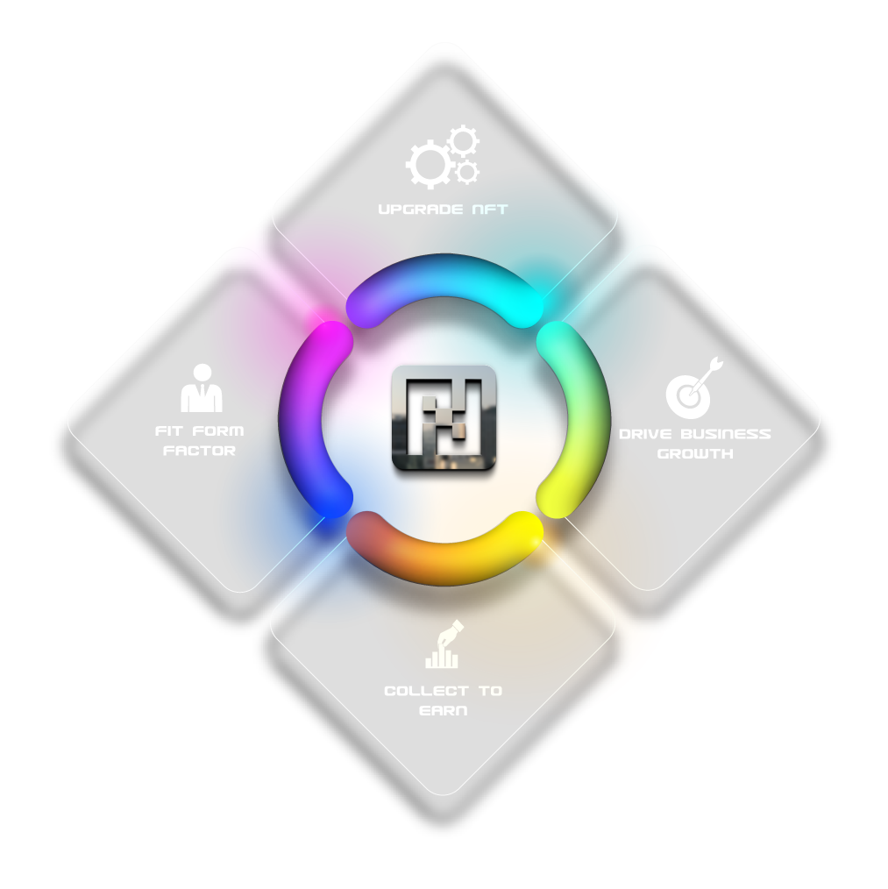

# Get Started

### The F-NFTs

Non-Fungible Token, concretely means an indivisible token, that is to say, an asset exchangeable on the blockchain, but not a crypto-currency. Snoop Dog, Activision or Atari, and big companies like artists are getting into Nfts, Reasons to care about Nfts An interesting technology NFTS is now one of the pillars of the blockchain ecosystem, if you missed Crypto-currencies or are not interested in them, NFTS will be a very good introduction to discovering what blockchain is.


[Broken link](broken-reference)


### Moving on

They are based on blockchain technology. These are transaction-recording distributed public ledgers. Each NFT is uniquely identified and stored on the blockchain with an identification code and metadata. “Metadata” means “data about data” in this context, and it is simply some additional information that describes the NFT and is stored alongside it.
