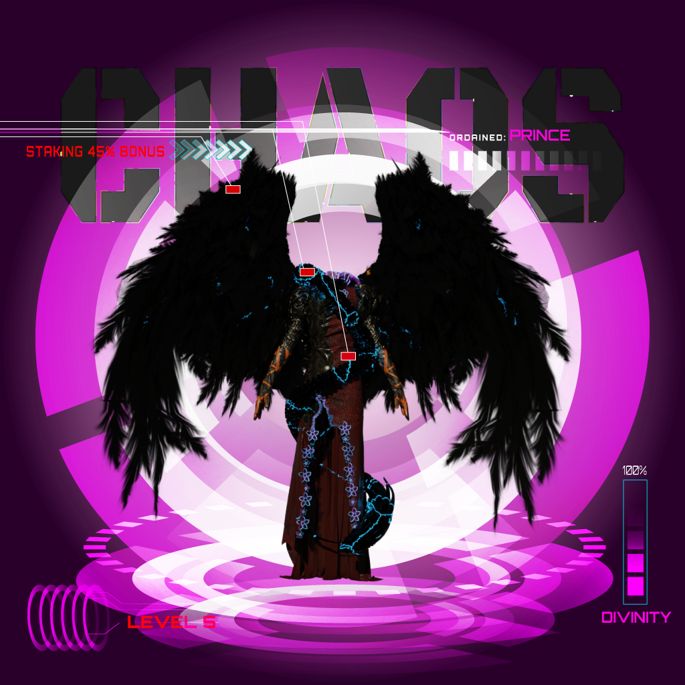

# Our Mission

### Our first collection

Our mission is to launch a mixed Nft project, as well as to offer a new and dependable system-based technology in the form of a 3d Nft fantasy fashion. Experts will share their perspectives on the economy with Nft fantasy fashion, provide crypto advice, and participate in our play-to-earn game. Anyone who has this Nft will be able to join our community. We promote transparent and secure transactions directly and reward our investors, and we provide a new platform where investors can enjoy a variety of benefits

### NFTs&#x20;

<figure><figcaption></figcaption></figure>

Non-Fungible Token, in concrete terms, means an indivisible token, that is, an asset that can be exchanged on the blockchain but is not a Crypto-currency. Snoop Dog, Activision, and Atari are just a few of the big companies that are getting into Nfts. A fascinating technology NFTS are now one of the pillars of the blockchain ecosystem; if you missed crypto-currencies or are uninterested in them, NFTS will be a great place to start learning about Blockchain. Keep in touch Everyone feared that they would end up like very old people today, completely overwhelmed by technology and, needless to say, somewhat isolated from the rest of the world.&#x20;

Don’t let this feeling overwhelm you; instead, begin taking an interest in this expanding universe right now. Whitepaper Follow your favorite musicians. Everyone is getting into NFTs, from Snoop Dog to Omar Sy to Jackie Chan, and if you’re a true fan of these great characters, you can’t miss the NFT trend. For example, Snoop Dog offered private gigs in exchange for holding some NFTS.


[the-journey-to-challenge-yourself.md](../our-products/the-journey-to-challenge-yourself.md)

