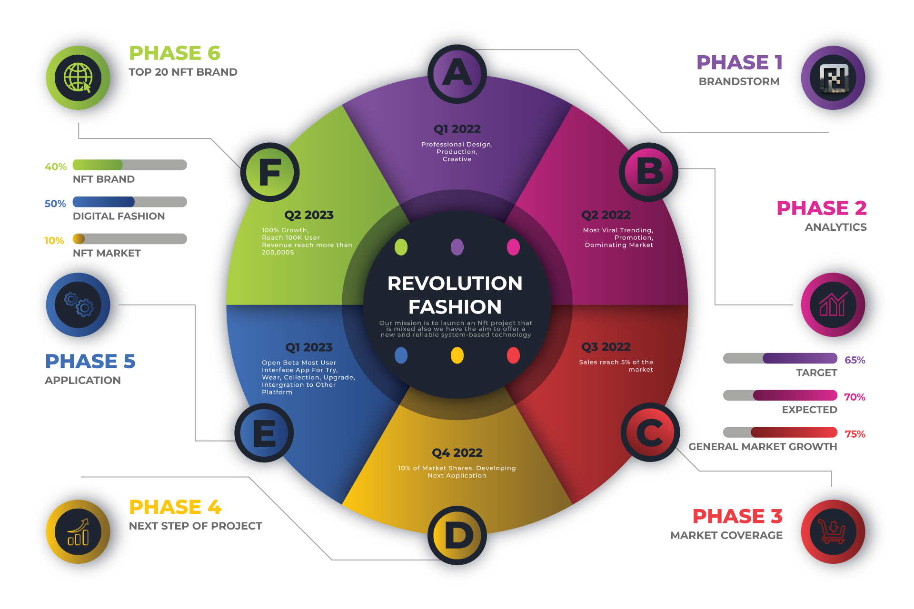

# Roadmap



### Q1 2022 - BRANDSTORM

IDEAS FOR A 3D FASHION BRAND CREATED WITH OBJECTIVES TO BRING A REAL VALUE TO THE NFT COMMUNITYQ1 2022

### Q2 2022 - MARKET ANALYTICS

WE HAVE BEEN PROVIDED THE MOST POSSIBLE OPTIONS TO START PROJECT IMPLEMENTATION AND STATISTICS MARKET ANALYSIS BY LEADING PROS.Q2 2022

### Q3 2022 - MARKET COVERAGE

SALES REACH 1% OF THE MARKETQ3 2022

### Q4 2022 - DOMINATE THE MARKET

10% MARKET SHARES; DEVELOP NEXT APPICATIONQ4 2022

### Q1 2023 - APPLICATION

OPEN BETA MOST USER INTERFACE APP FOR TRAIL UPGRADE - COLLECTIONS - AR WEAR INTEGRATION TO OTHER PLATFORMQ1 2023

### Q2 2023 - TOP NFT BRAND

100% GROWTH; REACH 100K USERS; REVENUE REACH MORE THAN 200,000$Block-based


WHY DISCLAIMER

Information is non-binding and subject to change. It is intended only to give potential investors and partners insight into the 3D NFT FANTASY FASHION business model as it is currently set up in web3 mode.&#x20;

The directors, partners, and advisors of 3D NFT FANTASY FASHION reserve the right to alter the models and information provided in this whitepaper as the business progresses and evolves


web3 syncing development​:

```
const ethers = Moralis.web3Library;

const daiAddress = "dai.tokens.ethers.eth";
const daiAbi = [
  "function name() view returns (string)",
  "function symbol() view returns (string)",
  "function balanceOf(address) view returns (uint)",
  "function transfer(address to, uint amount)",
  "event Transfer(address indexed from, address indexed to, uint amount)",
];
const daiContract = new ethers.Contract(daiAddress, daiAbi, provider);

const name = await daiContract.name();
console.log(name);
// 'f-nft.us'
```

<details>

<summary>The future of the internet and a shared 3D virtual universe that users can exist in perpetually. The next generation of this online reality will be across many metaverses that all have different characteristics and communities</summary>


</details>
