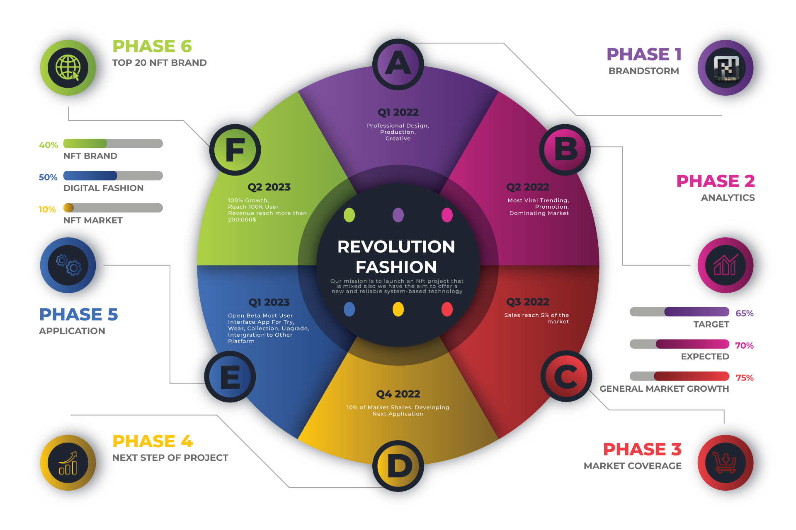

# Main f-nft Projects Develop

### Oriented development

Your friends will be impressed by most people who consider NFTS to be completely inaccessible, a chimera understood only by a select few. However, this is entirely false; you could understand how NFTS work and pass for a scholar in just a few hours! Invest in a future-oriented industry. If the hypothesis of a connected Metaverse appears realistic, NFTS could take a large share of the real economy in the coming years. As a result, it is critical that you become involved in this environment in order today to make the best decisions for your future finances.

<figure><figcaption></figcaption></figure>

Make money even though NFTs, like Cryptocurrencies, appear to have utility for most, the industry is plagued with a lot of speculation, and while there are most are losers, players still manage to emerge victorious from the market; If you master NFTs and the Blockchain, you will be able to take advantage of new Web3 features, such as Play to Earn, Run To Earn, Share To Earn (SocialFi), etc... So why shouldn’t you try? Begin now playing the newest platform "Wear to Earn" developed by F-NFT! These reward you in the form of objects, just like any other game, except that these objects are NFTs, which means they are immutable or exchangeable and sellable and of course, you generate income from your own understanding. \
`"Don't become someone's fat pie because of your indifference"`

``\
``NOT ONLY DO WE BELIEVE IN TRENDS, BUT ALSO IN THIS NEW BLOCKCHAIN-BACKED METAVERSE. EVERY STEP WE TAKE IS TO INNOVATE AND SUPPORT OUR USERS SO THAT THE VALUE OF BOTH THEIR DIGITAL AND PHYSICAL POSSESSIONS WILL INCREASE AND WE CAN HELP EACH OTHER IN THE FUTURE.&#x20;

WE WANT TO GO AS FAR AS WE CAN WITH GAMEFI, ROLE PLAY AND METAVERSE PLANS, INTEGRATIONS, AND OTHERS. ON MAIN, THE METAVERSE IS SPECIAL.
